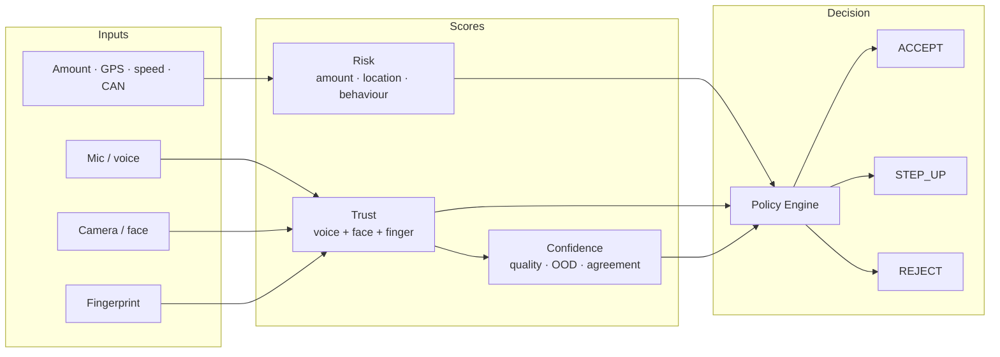
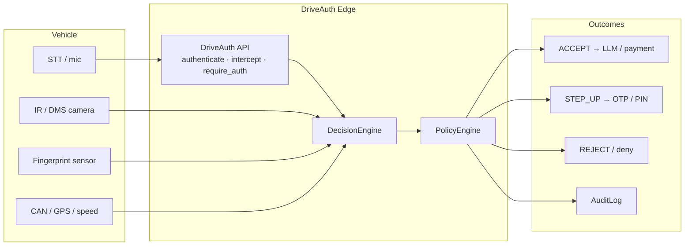
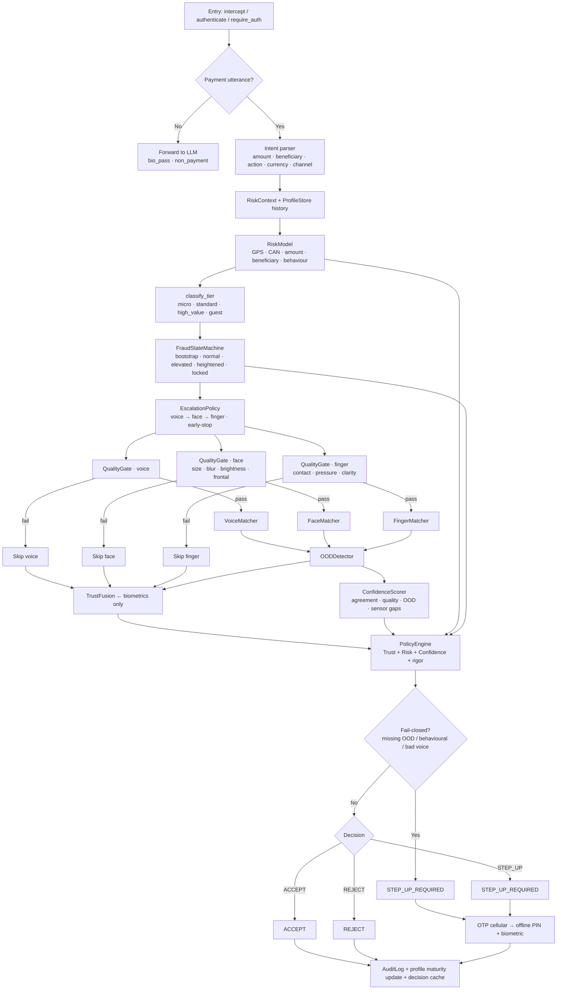
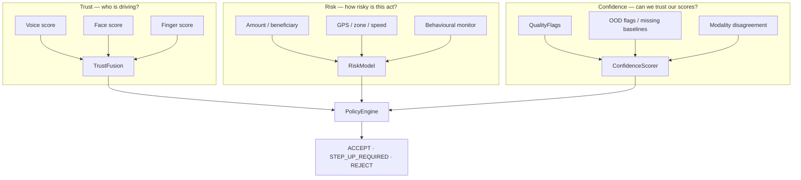
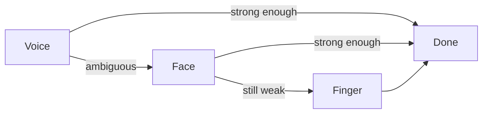
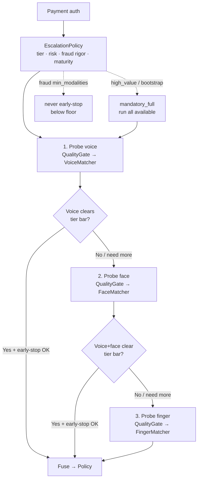
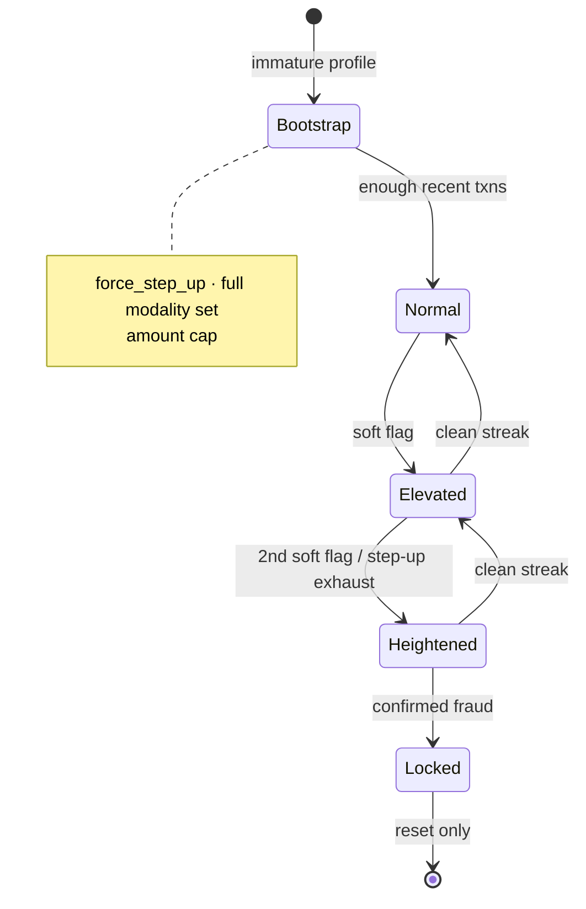
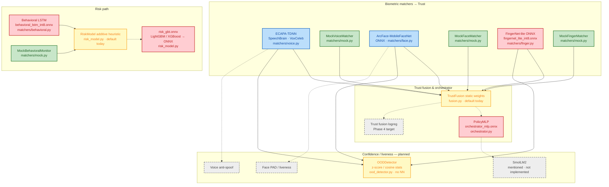

# DriveAuth Edge

Trust/Risk-separated biometric authorization for in-vehicle payments and sensitive commands. Extracted from [Nova AI](https://github.com/Senthi1Kumar/nova_ai) `pipeline_mp/driveauth/`.

**Requires Python 3.11+**

## Design principle

**Trust** answers: *"Is this the enrolled driver?"* (voice + face + fingerprint only)

**Risk** answers: *"How risky is this transaction?"* (GPS, speed, amount, beneficiary novelty, driving behaviour)

**Confidence** answers: *"Can we trust our own scores this time?"* (quality, OOD, modality agreement)

These three scores feed a **deterministic Policy Engine** — not another ML head — so compliance teams can audit and change rules without retraining models.

See [architecture/trust-risk-separation.md](architecture/trust-risk-separation.md) for score definitions, policy bands, and transaction tiers.

## Architecture

### Overview (simple)

Sensors and transaction context feed three independent scores; a deterministic policy decides the outcome.



### System context



### End-to-end pipeline

Non-payment commands (`open navigation`, `play music`, …) bypass the payment path entirely in `intercept()` — no risk scoring, tiering, or OTP.



### Trust / Risk / Confidence separation



Behaviour and location **never** enter Trust — only Risk. A night drive in an unfamiliar city raises scrutiny without distorting the biometric match.

### Staged escalation & fraud ladder

Simple view — probe cheapest first; stop when enough evidence; otherwise escalate:



Probe order is cheapest-friction first: **voice → face → finger**. Escalation stops early when the tier bar is met, but never below fraud `min_modalities`, and never early on high-value / bootstrap (full set required).



Fraud ladder (separate from probe order — raises rigor over time):



### Module map

| Layer | Module | Role |
|-------|--------|------|
| API | `api.py` | `DriveAuth`, Nova `intercept()` / `require_auth()`, cache, step-up orchestration |
| Intent | `intent.py` | Deterministic amount / beneficiary / action / currency parse |
| Orchestration | `decision_engine.py` | Quality → staged probes → fusion → policy → fail-closed |
| Escalation | `escalation.py` | Probe plan + early-stop rules |
| Biometrics | `matchers/` | Voice / face / finger / behavioural (+ mocks) |
| Quality | `quality_gate.py` | Pre-match SNR, blur, brightness, contact, frontal crop |
| Scores | `fusion.py`, `risk_model.py`, `ood_detector.py` | Trust, Risk, Confidence inputs |
| Policy | `policy_engine.py` | Deterministic tiered decisions |
| State | `fraud_state.py`, `profile_store.py` | Ladder rigor + driver maturity / amount stats |
| Step-up | `step_up_otp.py`, `step_up_fallback.py` | Cellular OTP → offline PIN + bio recheck |
| Audit | `audit_log.py` | Decision metadata (no raw biometrics) |
| Types | `types.py`, `config.py`, `policy.yaml` | Results, context, thresholds via `${ENV:default}` placeholders |

### Model blocks

Every ML/DL (and mock) head in the repo. Color key (see diagram fill):

| Color | Meaning |
|-------|---------|
| Green | **Mock** — wired placeholder; replace with a real model |
| Red | **Needs training** — loader/export path exists, but weights must be trained (or fine-tuned) before use |
| Blue | **Pretrained / off-the-shelf** — real model wired (Phase 2a); optional domain fine-tune later |
| Yellow | **Heuristic / static fallback** — runs today without weights; target is a trained model |
| Gray dashed | **Planned — not in repo yet** | 



#### Where each model sits

| Block | Algorithm | Module / artifact | Why this model | Status today |
|-------|-----------|-------------------|----------------|--------------|
| Voice | **ECAPA-TDNN** | `matchers/voice.py` · SpeechBrain `spkrec-ecapa-voxceleb` | Speaker embedding; cosine vs enrolled voiceprint | Blue — pretrained wired (Phase 2a); else green mock |
| Face | **ArcFace-MobileFaceNet** | `matchers/face.py` · `mobilefacenet*.onnx` | Face embedding match on IR/RGB crop | Blue — pretrained wired (Phase 2a); else green mock |
| Finger | **FingerNet-lite** | `matchers/finger.py` · `fingernet_lite_int8.onnx` | Fingerprint embedding / match | Red — loader ready, **no weights**; green mock until then |
| Behavioral | **LSTM** (or GRU / windowed GBM bake-off) | `matchers/behavioral.py` · `behavioral_lstm_int8.onnx` | Driving-style anomaly → **Risk only**, never Trust | Red — loader ready, **no weights**; green mock until then |
| Risk | **LightGBM or XGBoost** → ONNX | `risk_model.py` · `risk_gbt.onnx` | Tabular txn/GPS/CAN features; audit-friendly attributions | Yellow heuristic now; **red** once trained (`risk_gbt.onnx`). **XGBoost is not in the repo yet** — same slot as LightGBM |
| Trust weights | **PolicyMLP** | `orchestrator.py` · `orchestrator_mlp.onnx` | Context-adaptive voice/face/finger weights + uncertainty | Red — optional ONNX; yellow static weights if absent |
| Trust fusion | **Logistic regression** (Phase 4) | planned (today: weighted avg in `fusion.py`) | Calibrated ACCEPT/STEP_UP from labeled outcomes | Gray — **not implemented**; static fusion runs |
| OOD | Stats (z / cosine) | `ood_detector.py` | Fail-closed when baselines missing | Yellow — no neural net; optional AE later |
| Anti-spoof / PAD | TBD | planned | Replay / presentation attack | Gray — **not in repo** |
| SmolLM2 | LLM helper | docstring only in `orchestrator.py` | Optional narrative / policy assist | Gray — **not implemented** |

#### Not in the repo yet (planned separately)

These appear on the roadmap but have **no code path or weights** today:

| Planned model | Intended role | Replaces / extends |
|---------------|---------------|--------------------|
| **XGBoost** (alt to LightGBM) | Same `risk_gbt.onnx` risk head | Additive `RiskModel` heuristic |
| Trust-fusion **logreg** | Learned Trust from auth labels | Static `TrustFusion` weights |
| Voice **anti-spoof** | Replay / synthetic speech gate | QualityGate SNR only |
| Face **PAD** | Presentation-attack detection | QualityGate blur/brightness/frontal |
| **SmolLM2** | Optional orchestrator side-channel | — (unused) |
| OOD **autoencoder** | Embedding reconstruction anomaly | Current z-score / cosine OOD |

Default demo path (`use_mock_matchers=True` / `DRIVEAUTH_USE_MOCK=1`) uses **all green mocks**. Hybrid Phase 2a load uses blue pretrained voice/face when `ready`, and keeps finger + behavioral on green mocks until red weights exist.

### Decision cache (second-layer gate)

`require_auth()` may reuse a fresh STT-layer **ACCEPT** within `DRIVEAUTH_DECISION_CACHE_TTL_S` when:

- cached decision is ACCEPT
- new transaction tier ≤ cached tier
- fraud epoch unchanged
- profile epoch unchanged

Otherwise it re-probes (voice optional at the LLM tool boundary).

## Quick start

**Live demo?** Follow [`DEMO.md`](DEMO.md) (talk order + Thor tunnel + backup plan).

```bash
cd driveauth-edge
pip install -e ".[dev]"
bash scripts/demo_preflight.sh   # pytest + mock ACCEPT
driveauth-demo
# or: python demo/run_demo.py
```

Demo flags: `--amount`, `--beneficiary-known`, `--high-value`, `--reject-voice`.

### Web dashboard (pipeline tester)

```bash
pip install -e ".[dashboard]"
driveauth-dashboard
# open http://127.0.0.1:8765
```

Optional: `--store ./demo_store` for a persistent store, `--reload` for dev auto-reload.

### Programmatic use

```python
from driveauth import DriveAuth
import numpy as np

auth = DriveAuth.load(store_dir="./store", use_mock_matchers=True)
result = auth.authenticate(
    audio_np=np.zeros(16000, dtype=np.float32),
    amount=150.0,
    beneficiary_known=True,
)
print(result.decision, result.trust_score, result.risk_score)
```

Decisions: `ACCEPT`, `STEP_UP_REQUIRED`, `REJECT` (Nova-compatible aliases: `pass`, `step_up`, `deny`).

## Examples

| Script | What it shows |
|--------|----------------|
| [examples/basic_auth.py](examples/basic_auth.py) | Minimal mock-matcher authentication |
| [examples/payment_step_up.py](examples/payment_step_up.py) | High-value payment + vehicle context → step-up |

## Testing

```bash
pip install -e ".[dev]"
pytest
```

## Documentation

| Doc | Contents |
|-----|----------|
| [architecture/overview.md](architecture/overview.md) | Pipeline diagram and module map |
| [architecture/trust-risk-separation.md](architecture/trust-risk-separation.md) | Trust, Risk, Confidence scores and policy tiers |
| [docs/configuration.md](docs/configuration.md) | `policy.yaml` placeholders and `DRIVEAUTH_*` overrides |
| [docs/integration.md](docs/integration.md) | Nova AI migration, STT intercept contract, vehicle context |

## Repository layout

```
driveauth-edge/
├── README.md
├── pyproject.toml
├── architecture/          # Design docs + diagrams
├── dashboard/             # FastAPI pipeline tester + web UI
├── demo/                  # CLI demo (mock matchers)
├── driveauth/
│   ├── api.py             # Public DriveAuth API (+ Nova intercept())
│   ├── intent.py          # Payment intent parse (amount / beneficiary / …)
│   ├── config.py          # Loads policy.yaml (${ENV:default} placeholders)
│   ├── policy.yaml        # All thresholds — single source of truth
│   ├── decision_engine.py # Core pipeline orchestration
│   ├── escalation.py      # Staged voice → face → finger probing
│   ├── fusion.py          # TrustFusion + ConfidenceScorer
│   ├── matchers/          # Voice / face / finger / behavioural matchers
│   ├── policy_engine.py   # Tiered ACCEPT / STEP_UP / REJECT rules
│   ├── risk_model.py      # Context risk scoring (CPU)
│   ├── fraud_state.py     # Fraud ladder FSM (+ bootstrap)
│   ├── profile_store.py   # Driver maturity + amount stats
│   ├── quality_gate.py    # Pre-matching signal quality
│   ├── ood_detector.py    # Out-of-distribution flags (fail-closed)
│   ├── orchestrator.py    # Optional dynamic trust weights (PolicyMLP)
│   ├── step_up_otp.py     # Cellular OTP step-up
│   ├── step_up_fallback.py# Offline PIN + biometric fallback
│   ├── audit_log.py       # Decision metadata audit trail
│   └── types.py           # Decision, DriveAuthResult, RiskContext
├── tests/
├── examples/
└── docs/
```

## Nova AI integration

Replace:

```python
from driveauth.gate import DriveAuthGate
```

With (add `driveauth-edge` to your path or install as package):

```python
from driveauth import DriveAuth as DriveAuthGate
```

Or install editable: `pip install -e /path/to/driveauth-edge`

Set `DRIVEAUTH_STORE_DIR` and `DRIVEAUTH_ENROLL_DIR` (voiceprints from L-3 enrollment).

Environment variables use `DRIVEAUTH_*` prefix; `NOVA_*` aliases are supported for drop-in compatibility.

Full migration steps: [docs/integration.md](docs/integration.md).

## Optional dependencies

| Extra | Purpose |
|-------|---------|
| `voice` | ECAPA-TDNN via SpeechBrain |
| `face` | MobileFaceNet ONNX + OpenCV |
| `onnx` | Risk model + orchestrator MLP |
| `orchestrator` | Dynamic trust weights (PolicyMLP) |
| `dashboard` | FastAPI web UI + pipeline API |
| `dev` | pytest + ruff |
| `all` | All of the above |

## License

Same lineage as Nova AI — see parent repository for license terms.
