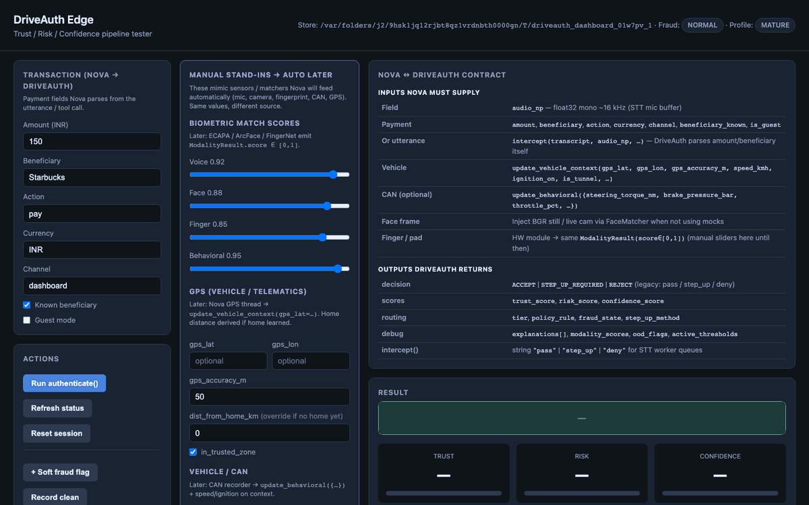
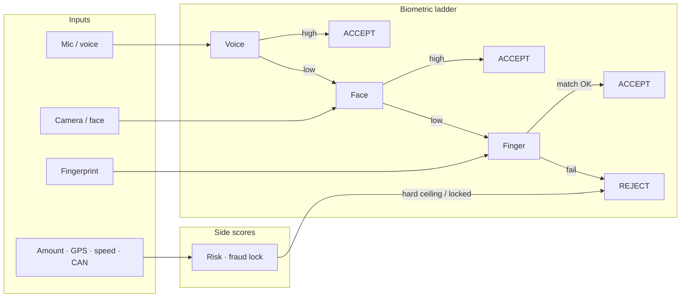
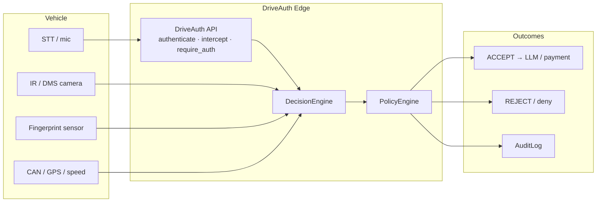
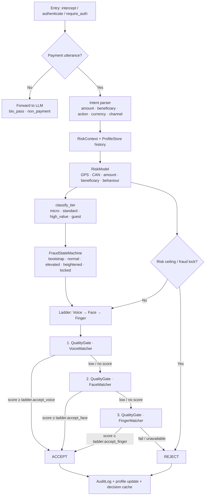
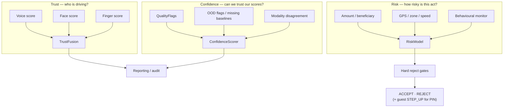
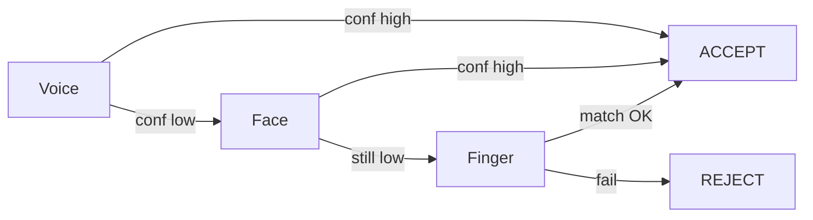
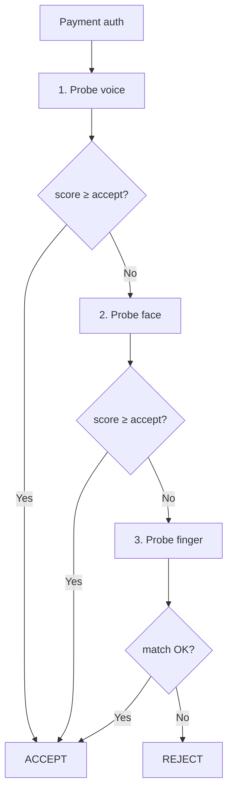
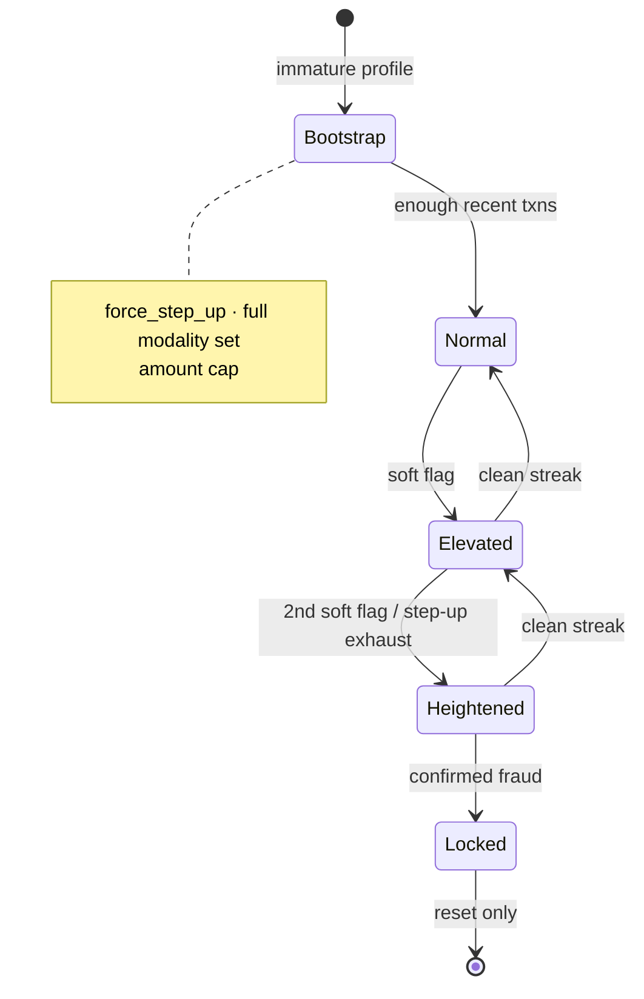
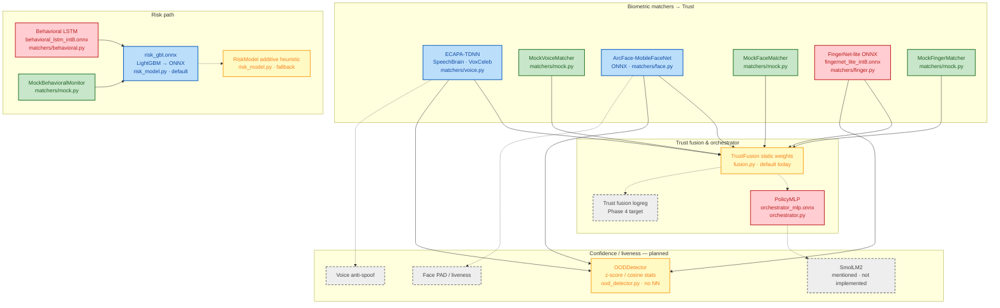

# DriveAuth Edge

Trust/Risk-separated biometric authorization for in-vehicle payments and sensitive commands. Extracted from [Nova AI](https://github.com/Senthi1Kumar/nova_ai) `pipeline_mp/driveauth/`.

**Requires Python 3.11+**

> **Tech stack**
>
> | Layer | Stack |
> |-------|--------|
> | Core | Python 3.11+, NumPy, PyYAML, cryptography · Hatchling |
> | API / UI | FastAPI, Uvicorn · demo capture: Pillow, Playwright |
> | Voice | PyTorch + SpeechBrain (ECAPA-TDNN / VoxCeleb) |
> | Face | OpenCV + ONNX Runtime (MobileFaceNet / ArcFace) |
> | Finger / behavior | ONNX (FingerNet-lite, behavioral LSTM) |
> | Risk / fusion / PAD | LightGBM → ONNX · scikit-learn / logreg → ONNX |
> | Orchestrator | PolicyMLP ONNX (static trust weights if absent) |
> | Train / export | LightGBM, scikit-learn, onnxmltools, skl2onnx, onnx |
> | Dev | pytest, ruff |
>
> Policy is deterministic YAML rules (not another ML head). Extras: `.[dashboard]`, `.[voice,face,onnx]`, `.[standalone]`, `.[all]`.

## Demo

Dashboard presets: **Micro payment → ACCEPT**, **Low voice → Face ACCEPT**, **Low biometrics → REJECT** (Voice → Face → Finger ladder).



Regen: `driveauth-dashboard` + `python scripts/capture_dashboard_demo_gif.py` (needs `pillow` + `playwright`).

## Design principle

**Trust** answers: *"Is this the enrolled driver?"* (voice + face + fingerprint only)

**Risk** answers: *"How risky is this transaction?"* (GPS, speed, amount, beneficiary novelty, driving behaviour)

**Confidence** answers: *"Can we trust our own scores this time?"* (quality, OOD, modality agreement)

These three scores feed a **deterministic Policy Engine** — not another ML head — so compliance teams can audit and change rules without retraining models. Architecture, policy bands, and the fraud ladder are **shipping**.

See [architecture/trust-risk-separation.md](architecture/trust-risk-separation.md) for score definitions, policy bands, and transaction tiers.

**Security:** what we assume, enforce, and explicitly do **not** claim — including fail-closed probes, OOD-refresh gating, optional timing pad, and HW/synth limits — is in [`docs/security-assumptions.md`](docs/security-assumptions.md).

## Architecture

### Overview (simple)

Sensors and transaction context feed three independent scores; a deterministic policy decides the outcome.



### System context



### End-to-end pipeline

Non-payment commands (`open navigation`, `play music`, …) bypass the payment path entirely in `intercept()` — no risk scoring, tiering, or OTP.



### Trust / Risk / Confidence separation



Behaviour and location **never** enter Trust — only Risk. Biometric Accept/Reject is decided only by the Voice → Face → Finger ladder.

### Biometric ladder (Accept / Reject)



Probe order is fixed: **voice → face → finger**.

- **High score** (per-modality bar + fraud `trust_margin`) → **ACCEPT** immediately:
  - voice `≥ ladder.accept_voice` (default **0.72**)
  - face `≥ ladder.accept_face` (default **0.70**)
  - finger `≥ ladder.accept_finger` (default **0.70**, “match OK”)
- **Low / missing score** → escalate to the next modality.
- After fingerprint (last option) still fails → **REJECT**.
- No OTP mid-ladder. Risk hard-ceiling and fraud-lock can still force REJECT. Guest mode may still request PIN (`STEP_UP_REQUIRED`).
- Re-baseline with `python scripts/calibrate_bio_thresholds.py --store ./driveauth_store_phase2a`.



Fraud ladder (separate from probe order — raises rigor over time):



### Module map

| Layer | Module | Role |
|-------|--------|------|
| API | `api.py` | `DriveAuth`, Nova `intercept()` / `require_auth()`, cache, step-up orchestration |
| Intent | `intent.py` | Deterministic amount / beneficiary / action / currency parse |
| Orchestration | `decision_engine.py` | Quality → staged probes → fusion → policy → fail-closed |
| Escalation | `escalation.py` | Probe plan + early-stop rules |
| Biometrics | `matchers/` | Voice / face / finger / behavioural (+ mocks) |
| Quality | `quality_gate.py` | Pre-match SNR, blur, brightness, contact, frontal crop |
| Scores | `fusion.py`, `risk_model.py`, `ood_detector.py`, `geo.py` | Trust, Risk, Confidence + GPS → home distance |
| Policy | `policy_engine.py` | Deterministic tiered decisions |
| State | `fraud_state.py`, `profile_store.py` | Ladder rigor + driver maturity / amount / home |
| Step-up | `step_up_otp.py`, `step_up_fallback.py` | Cellular OTP → offline PIN + bio recheck |
| Audit | `audit_log.py` | Decision metadata (no raw biometrics) |
| Types | `types.py`, `config.py`, `policy.yaml` | Results, context, thresholds via `${ENV:default}` placeholders |
| Manual HW stand-in | `matchers/score_provider.py` | `ManualScores` / `DRIVEAUTH_MANUAL_SCORES` until sensors |

### Model blocks

Every ML/DL (and mock) head in the repo. Color key (see diagram fill):

| Color | Meaning |
|-------|---------|
| Green | **Mock** — wired placeholder; replace with a real model |
| Red | **Needs training** — loader/export path exists, but weights must be trained (or fine-tuned) before use |
| Blue | **Pretrained / off-the-shelf** — real model wired (Phase 2a); optional domain fine-tune later |
| Yellow | **Heuristic / static fallback** — runs today without weights; target is a trained model |
| Gray dashed | **Planned — not in repo yet** | 



#### Where each model sits

| Block | Algorithm | Module / artifact | Why this model | Status today |
|-------|-----------|-------------------|----------------|--------------|
| Voice | **ECAPA-TDNN** | `matchers/voice.py` · SpeechBrain `spkrec-ecapa-voxceleb` | Speaker embedding; cosine vs enrolled voiceprint | Blue — Phase 2a pretrained + enrolled (`DRIVEAUTH_USE_MOCK=0`) |
| Face | **ArcFace-MobileFaceNet** | `matchers/face.py` · `mobilefacenet*.onnx` | Face embedding match on IR/RGB crop | Blue — Phase 2a pretrained + enrolled (own-face) |
| Finger | **FingerNet-lite** | `matchers/finger.py` · `fingernet_lite_int8.onnx` | Fingerprint embedding / match | Green mock / `ManualScores` until sensor HW + vendor SDK |
| Behavioral | **LSTM** (or GRU / windowed GBM bake-off) | `matchers/behavioral.py` · `behavioral_lstm_int8.onnx` | Driving-style anomaly → **Risk only**, never Trust | LSTM wired from **synth** bake-off — re-bake on real CAN before citing FAR/FRR |
| Risk | **LightGBM** → ONNX | `risk_model.py` · `risk_gbt.onnx` | Tabular txn/GPS/CAN features; audit-friendly attributions | Blue — trained on 50k txns (val AUC ≈ 0.9955); additive heuristic if ONNX missing |
| Trust weights | **PolicyMLP** | `orchestrator.py` · `orchestrator_mlp.onnx` | Context-adaptive voice/face/finger weights + uncertainty | Red — optional ONNX; yellow static weights if absent |
| Trust fusion | **Logistic regression** | `fusion.py` · `trust_fusion.onnx` | Learned Trust from labeled multimodal scores; static weights if ONNX missing | Blue — Stage 2 / Phase 4 trained |
| OOD | Stats (z / cosine) | `ood_detector.py` | Fail-closed when baselines missing | Yellow — no neural net; optional AE later |
| Anti-spoof / PAD | Hand-crafted features → logreg | `matchers/face_pad_features.py` · `face_pad.onnx` | Presentation-attack gate before face match | Blue — Stage 2 (blur/side/screen) |
| SmolLM2 | LLM helper | docstring only in `orchestrator.py` | Optional narrative / policy assist | Gray — **not implemented** |

#### Stage 2 heads (wired; frozen ECAPA / MobileFaceNet)

| Head | Artifact | Trainer |
|------|----------|---------|
| Voice calibrator | `voice_calibrator.onnx` | `scripts/train_voice_calibrator.py` |
| Face PAD | `face_pad.onnx` | `scripts/train_face_pad.py` |
| Face calibrator | `face_calibrator.onnx` | `scripts/train_face_calibrator.py` |
| Trust fusion logreg | `trust_fusion.onnx` | `scripts/train_trust_fusion.py` |
| FAR/FRR eval | `phases/phase2b_bio_eval.json` | `scripts/eval_bio_far_frr.py` |
| Sprint 6 bench | `phases/phase6_sprint6.json` · `phase6.md` | `scripts/phase6_benchmark.py` |

Phase 2a latency profiles: [`phases/phase2a-mac.txt`](phases/phase2a-mac.txt) · [`phases/phase2a-thor.txt`](phases/phase2a-thor.txt) (Thor: ECAPA+face **CUDA**, micro/high p95 ≈ 7.7 / 9.2 ms). Phase 1 mock edge profiles: [`phases/mac.txt`](phases/mac.txt) · [`phases/thor.txt`](phases/thor.txt) ([`phases/phase1.md`](phases/phase1.md)).

Set `DRIVEAUTH_STAGE2_RAW=1` to force frozen 2a cosine-only scoring (no PAD/calibrators).

#### Still planned / HW-gated

| Planned model | Intended role | Replaces / extends |
|---------------|---------------|--------------------|
| Voice **anti-spoof** (deep) | Replay / synthetic speech gate | QualityGate + score calibrator |
| Real-CAN behavioral re-bake | Production FAR/FRR for driving style | Current synth bake-off winner |
| **SmolLM2** | Optional orchestrator side-channel | — (unused) |
| OOD **autoencoder** | Embedding reconstruction anomaly | Current z-score / cosine OOD |

Default dashboard path uses **mock biometrics** + real risk ONNX when present. Hybrid Phase 2a:

```bash
python scripts/phase2a_setup.py --store ./driveauth_store_phase2a
python scripts/phase2a_enroll.py --store ./driveauth_store_phase2a --data ./data/driver1
python scripts/phase2a_demo.py --store ./driveauth_store_phase2a
```

Finger/behavioral: set scores via dashboard **Manual stand-ins**, `DRIVEAUTH_MANUAL_SCORES=…`, or `apply_manual_scores()` until HW modules emit the same `ModalityResult(score∈[0,1])`. See [`roadmap-2026-07.md`](roadmap-2026-07.md).

### Decision cache (second-layer gate)

`require_auth()` may reuse a fresh STT-layer **ACCEPT** within `DRIVEAUTH_DECISION_CACHE_TTL_S` when:

- cached decision is ACCEPT
- new transaction tier ≤ cached tier
- fraud epoch unchanged
- profile epoch unchanged

Otherwise it re-probes (voice optional at the LLM tool boundary).

## Quick start

```bash
cd staged_driveauth-edge   # or your clone path
python3.11 -m venv .venv && source .venv/bin/activate
pip install -e ".[dev]"
bash scripts/demo_preflight.sh   # pytest + mock ACCEPT
driveauth-demo
# or: python demo/run_demo.py
```

Demo flags: `--amount`, `--beneficiary-known`, `--high-value`, `--reject-voice`.

### Web dashboard (two pipelines)

Shared on both pages: **Actions** · **Live security pipeline** (Voice→Face→Finger staircase) · **Result** · **Audit log**.

| Page | URL | Purpose |
|------|-----|---------|
| Manual | `/` or `/manual` | Slider stand-ins + presets (mock path) |
| Standalone | `/standalone` | OpenRouter STT/TTS · intent slots · Maps GPS · live ECAPA/face |
| Register | `/register` | Capture + enroll · registered-drivers list · Maps home pin |

```bash
pip install -e ".[dashboard]"          # manual / mock dashboard
# or: pip install -e ".[standalone]"   # + voice/face/onnx for live path
cp secrets.env.example secrets.env     # OpenRouter + Google Maps (standalone)
driveauth-dashboard
# http://127.0.0.1:8765/manual
# http://127.0.0.1:8765/standalone
# http://127.0.0.1:8765/register
```

Optional: `--store ./demo_store` for a persistent store, `--reload` for dev auto-reload.

**Register:** open `/register`, pick or create a driver id, capture ≥5 face stills + ≥5 voice clips (`data/<id>/{face,voice}/enroll/`), mark **home** on Maps, then **Enroll into store**. The page lists every known driver with enrollment status. Needs Phase 2a models (`python scripts/phase2a_setup.py`). Paths: `DRIVEAUTH_REGISTER_STORE` / `DRIVEAUTH_DATA_ROOT` / `secrets.env`.

**Standalone product** (shipping): OpenRouter STT/TTS/intent, live ECAPA/face, Maps GPS, and the three pages above — details in [`docs/standalone.md`](docs/standalone.md).

**Public demo:** `cloudflared tunnel --url http://127.0.0.1:8765` (Mac must stay awake). Always-on Railway `/data` volume is still open (see [What's left](#whats-left)).

### Phase 2a real voice/face (hybrid)

```bash
pip install -e ".[voice,face,onnx,dev]"
python scripts/phase2a_setup.py --store ./driveauth_store_phase2a
python scripts/phase2a_enroll.py --store ./driveauth_store_phase2a --data ./data/driver1
python scripts/phase2a_demo.py --store ./driveauth_store_phase2a \
  --face-image data/driver1/face/enroll/enroll_01.jpg
```

Finger / behavioral scores for demos:

```bash
python scripts/phase3_synth_demo.py --store ./driveauth_store_phase2a --scenario happy
# or: export DRIVEAUTH_MANUAL_SCORES=phases/manual_scores_fail.json
```

### Programmatic use

```python
from driveauth import DriveAuth
import numpy as np

auth = DriveAuth.load(store_dir="./store", use_mock_matchers=True)
auth.update_vehicle_context(
    gps_lat=12.97, gps_lon=77.59, gps_accuracy_m=8.0,
    speed_kmh=0.0, ignition_on=True,
)
result = auth.authenticate(
    audio_np=np.zeros(16000, dtype=np.float32),
    amount=150.0,
    beneficiary="Starbucks",
    beneficiary_known=True,
)
print(result.decision, result.legacy_decision, result.trust_score, result.risk_score)
```

Decisions: `ACCEPT`, `REJECT` from the biometric ladder; `STEP_UP_REQUIRED` remains for guest PIN / OTP fallbacks only (Nova aliases: `pass`, `step_up`, `deny`).

## Phase 3 data

Min sets are in place: voice · face (own-face) · synth finger/CAN/OOD · 50k txns. See [`data/README.md`](data/README.md). Layout under `data/driver1/`:

| Path | Contents |
|------|----------|
| `voice/` | enroll · genuine · noisy · attack_* |
| `face/` | enroll · genuine · attack_blur / side / replay_screen |
| `finger/` · `behavioral/` · `ood/` | Synth via `scripts/generate_phase3_synth.py` until HW |
| `transaction/` | 50k txn rows for the Risk head |

```bash
python scripts/generate_phase3_synth.py
python scripts/calibrate_bio_thresholds.py --store ./driveauth_store_phase2a --apply
```

## Examples

| Script | What it shows |
|--------|----------------|
| [examples/basic_auth.py](examples/basic_auth.py) | Minimal mock-matcher authentication |
| [examples/payment_step_up.py](examples/payment_step_up.py) | High-value payment + vehicle context → step-up |
| [scripts/phase2a_demo.py](scripts/phase2a_demo.py) | Real ECAPA + MobileFaceNet hybrid auth |
| [scripts/train_behavioral_bakeoff.py](scripts/train_behavioral_bakeoff.py) | LSTM vs GRU vs windowed GBM → best → `behavioral_model.onnx` |
| [scripts/train_trust_fusion.py](scripts/train_trust_fusion.py) | Stage 2 trust logreg → `trust_fusion.onnx` |
| [scripts/eval_bio_far_frr.py](scripts/eval_bio_far_frr.py) | Voice/face FAR/FRR vs baseline (`phase2b_bio_eval.json`) |
| [scripts/phase6_benchmark.py](scripts/phase6_benchmark.py) | Sprint 6 table + ablations → `phases/phase6.md` |

## Testing

```bash
pip install -e ".[dev]"
pytest
```

**160+** tests cover fail-closed paths, cache invalidation, geo/home learning, score
provider, Sprint 1 security (constant-time pad + OOD-refresh gate), Phase 5
(threshold re-baseline + real-model timeout/crash), Phase 6 / Sprint 6 benchmarks
(FAR/FRR/EER/ROC · PAD · risk · latency · vs OTP/MFA/staged), and the standalone
session — see [`phases/phase5.md`](phases/phase5.md) · [`phases/phase6.md`](phases/phase6.md).

## Documentation

Phase 7 docs are in place: this README, demo GIF, security assumptions, and
LinkedIn/Medium drafts ([`docs/public-posts.md`](docs/public-posts.md); publish
URLs still open). Phase 8 drafts live under [`docs/paper/`](docs/paper/) — see
[What's left](#whats-left).

| Doc | Contents |
|-----|----------|
| [architecture/overview.md](architecture/overview.md) | Pipeline diagram and module map |
| [architecture/trust-risk-separation.md](architecture/trust-risk-separation.md) | Trust, Risk, Confidence scores and policy tiers |
| [docs/security-assumptions.md](docs/security-assumptions.md) | **Threat model, invariants, non-claims, integrator checklist** |
| [docs/public-posts.md](docs/public-posts.md) | LinkedIn / Medium drafts (Phase 7) |
| [phases/phase8.md](phases/phase8.md) · [docs/paper/](docs/paper/) | White paper · IV 2027 draft · demo storyboard |
| [roadmap-2026-07.md](roadmap-2026-07.md) | Current roadmap — phases, sprints, non-goals |
| [TODO.txt](TODO.txt) | Working checklist (deferred HW / Nova GPS / publish called out) |
| [docs/standalone.md](docs/standalone.md) | Standalone product: OpenRouter STT/TTS, Maps, Cloudflare tunnel, Railway |
| [docs/pipeline-fixes-2026-07.md](docs/pipeline-fixes-2026-07.md) | Risk-pipeline fix bundle details |
| [docs/configuration.md](docs/configuration.md) | `policy.yaml` placeholders and `DRIVEAUTH_*` overrides |
| [docs/integration.md](docs/integration.md) | **Nova ↔ DriveAuth I/O contract**, STT intercept, GPS/CAN |
| [data/README.md](data/README.md) | Phase 3 capture layout + synth generators |
| [phases/phase6.md](phases/phase6.md) | Sprint 6 FAR/FRR/EER · PAD · risk · latency · ablations |

## Repository layout

```
staged_driveauth-edge/
├── README.md · TODO.txt · roadmap-2026-07.md
├── secrets.env.example    # copy → secrets.env (gitignored)
├── Dockerfile · railway.toml
├── pyproject.toml
├── architecture/          # Design docs + diagrams
├── dashboard/             # /manual · /standalone · /register (+ standalone_ui)
├── demo/                  # CLI demo (mock matchers)
├── data/                  # Phase 3 datasets (biometrics gitignored)
├── scripts/               # phase2a_*, generate_*, calibrate_*, overfit_audit
├── phases/                # calibration JSON, timing notes, Sprint 6
├── driveauth/
│   ├── api.py             # Public DriveAuth API (+ Nova intercept())
│   ├── secrets.py · openrouter_client.py · standalone_session.py
│   ├── audio_io.py · enrollment.py · geo.py · intent.py
│   ├── config.py · policy.yaml
│   ├── decision_engine.py · escalation.py · fusion.py
│   ├── matchers/          # voice · face · finger · behavioral · score_provider
│   ├── risk_model.py · fraud_state.py · profile_store.py
│   ├── quality_gate.py · ood_detector.py · orchestrator.py
│   ├── step_up_otp.py · step_up_fallback.py · audit_log.py
│   └── types.py
├── tests/
├── examples/
└── docs/                  # standalone.md · security-assumptions · integration
```

## Nova AI integration

Replace:

```python
from driveauth.gate import DriveAuthGate
```

With:

```python
from driveauth import DriveAuth as DriveAuthGate
```

Or install editable: `pip install -e /path/to/staged_driveauth-edge`

Set `DRIVEAUTH_STORE_DIR` and `DRIVEAUTH_ENROLL_DIR`. Env vars use `DRIVEAUTH_*` (`NOVA_*` aliases supported).

**Inputs / outputs** (payment path): see the dashboard contract panel and [docs/integration.md](docs/integration.md). **Nova live GPS is deferred** — Maps / dashboard GPS until Nova telematics calls `update_vehicle_context` each auth:

```python
auth.update_vehicle_context(gps_lat=…, gps_lon=…, gps_accuracy_m=…, speed_kmh=…, ignition_on=…)
```

## Optional dependencies

| Extra | Purpose |
|-------|---------|
| `voice` | ECAPA-TDNN via SpeechBrain |
| `face` | MobileFaceNet ONNX + OpenCV |
| `onnx` | Risk model + orchestrator MLP |
| `orchestrator` | Dynamic trust weights (PolicyMLP) |
| `dashboard` | FastAPI web UI + pipeline API |
| `dev` | pytest + ruff |
| `all` | All of the above |

## What's left

Shipped work is woven into the sections above (architecture, Phase 2a models +
latency, Phase 3 data, standalone dashboard, tests, Sprint 6, Phase 7 docs).
Full checklist: [`TODO.txt`](TODO.txt) · plan: [`roadmap-2026-07.md`](roadmap-2026-07.md).

| Gap | Required to complete |
|-----|----------------------|
| Finger sensor path | Vendor SDK + real captures → drop `ManualScores` / mock finger |
| Behavioral on real CAN | Recorder dumps under `data/*/behavioral/{genuine,attack}/` → re-run `scripts/train_behavioral_bakeoff.py` → re-enroll |
| Nova live GPS | Wire telematics → `update_vehicle_context` each auth (Maps/dashboard stand-in until then) |
| Always-on public demo | Railway (or similar) with persistent `/data` volume — Cloudflare quick tunnel needs Mac awake |
| Policy bar refresh | Re-check bars after Stage 2; do **not** apply `phases/phase2b_suggested.env` until face overlap is acceptable |
| Phase 7 publish | Post LinkedIn/Medium from [`docs/public-posts.md`](docs/public-posts.md); paste URLs in that file |
| Phase 8 publications | Authors · IEEE template · figures · record demo video · submit **IV 2027** by **15 Nov 2026** ([`phases/phase8.md`](phases/phase8.md)) |
| Risk on live labels | Retrain Risk head only after ~5k real txn labels (explicit non-goal before then) |

## License

Same lineage as Nova AI — see parent repository for license terms.
