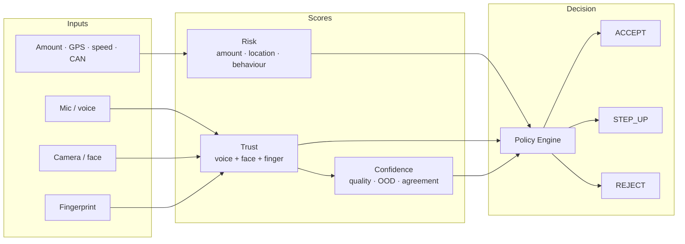
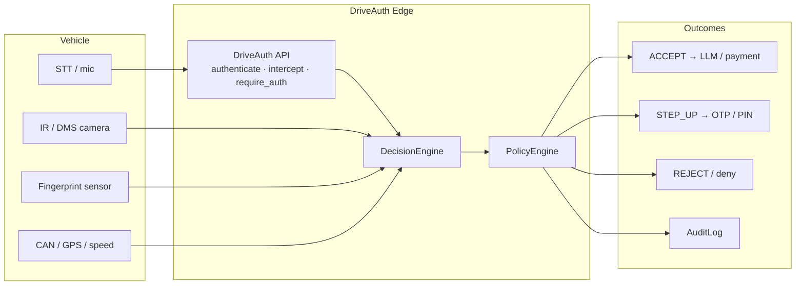
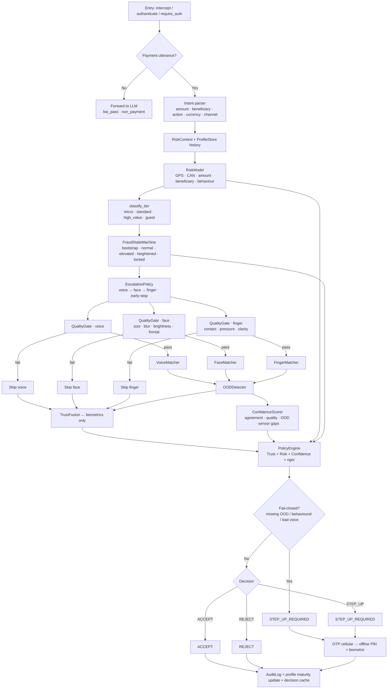
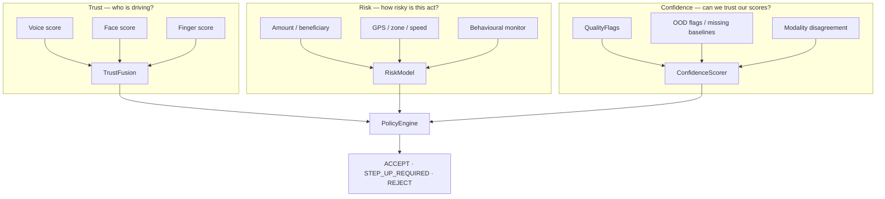
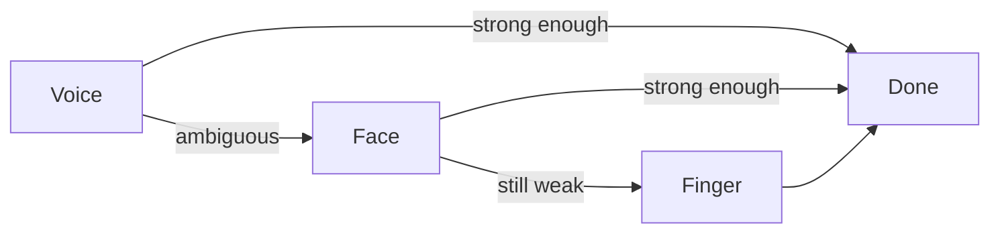
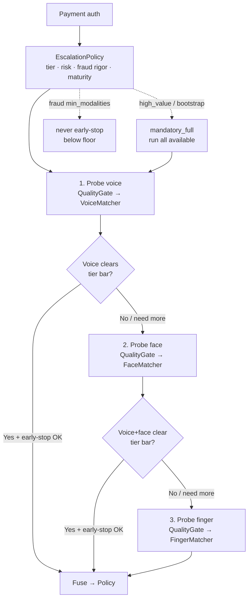
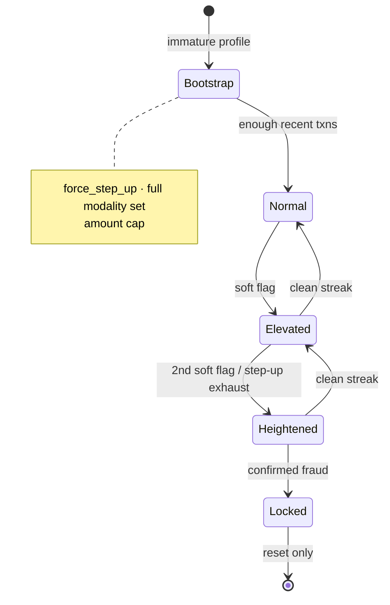
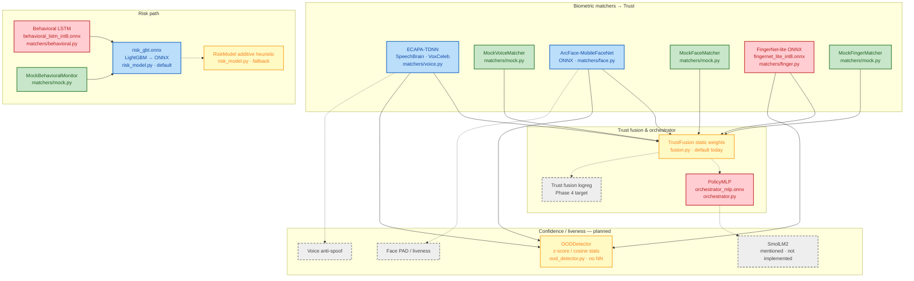

# DriveAuth Edge

Trust/Risk-separated biometric authorization for in-vehicle payments and sensitive commands. Extracted from [Nova AI](https://github.com/Senthi1Kumar/nova_ai) `pipeline_mp/driveauth/`.

**Requires Python 3.11+**

## Status (July 2026)

| Area | State |
|------|--------|
| Architecture / policy / fraud ladder | ✅ Shipping |
| Phase 1 Edge (Mac + Thor mock) | ✅ Profiles in `phases/mac.txt` · `phases/thor.txt` ([`phases/phase1.md`](phases/phase1.md)) |
| Phase 2a latency (Mac + Thor) | ✅ `phases/phase2a-mac.txt` · `phases/phase2a-thor.txt` (Thor: ECAPA+face **CUDA**) |
| Risk head (LightGBM → ONNX) | ✅ Trained on 50k txns, val AUC ≈ 0.9955 |
| Voice (ECAPA-TDNN) + face (MobileFaceNet) | ✅ Pretrained wired + enrolled (Phase 2a) |
| Finger / behavioral | ⏳ Mock + synthetic data; HW / ManualScores until sensors |
| Phase 3 datasets | ✅ Voice · face · synth finger/CAN/OOD · 50k txns |
| Nova live GPS | ⏳ Deferred — set manually in dashboard until integration |
| Tests | ✅ ~98 incl. timing pad + OOD-drift (`tests/test_security_sprint1.py`) |

Full plan: [`roadmap-2026-07.md`](roadmap-2026-07.md) · checklist: [`TODO.txt`](TODO.txt)

## Demo

Dashboard presets: **Micro payment → ACCEPT**, then **High value → STEP_UP** (Trust / Risk / Confidence → policy decision).


Regen: `driveauth-dashboard` + `python scripts/capture_dashboard_demo_gif.py` (needs `pillow` + `playwright`).

## Design principle

**Trust** answers: *"Is this the enrolled driver?"* (voice + face + fingerprint only)

**Risk** answers: *"How risky is this transaction?"* (GPS, speed, amount, beneficiary novelty, driving behaviour)

**Confidence** answers: *"Can we trust our own scores this time?"* (quality, OOD, modality agreement)

These three scores feed a **deterministic Policy Engine** — not another ML head — so compliance teams can audit and change rules without retraining models.

See [architecture/trust-risk-separation.md](architecture/trust-risk-separation.md) for score definitions, policy bands, and transaction tiers.

## Architecture

### Overview (simple)

Sensors and transaction context feed three independent scores; a deterministic policy decides the outcome.



### System context



### End-to-end pipeline

Non-payment commands (`open navigation`, `play music`, …) bypass the payment path entirely in `intercept()` — no risk scoring, tiering, or OTP.



### Trust / Risk / Confidence separation



Behaviour and location **never** enter Trust — only Risk. A night drive in an unfamiliar city raises scrutiny without distorting the biometric match.

### Staged escalation & fraud ladder

Simple view — probe cheapest first; stop when enough evidence; otherwise escalate:



Probe order is cheapest-friction first: **voice → face → finger**. Escalation stops early when the tier bar is met, but never below fraud `min_modalities`, and never early on high-value / bootstrap (full set required).



Fraud ladder (separate from probe order — raises rigor over time):



### Module map

| Layer | Module | Role |
|-------|--------|------|
| API | `api.py` | `DriveAuth`, Nova `intercept()` / `require_auth()`, cache, step-up orchestration |
| Intent | `intent.py` | Deterministic amount / beneficiary / action / currency parse |
| Orchestration | `decision_engine.py` | Quality → staged probes → fusion → policy → fail-closed |
| Escalation | `escalation.py` | Probe plan + early-stop rules |
| Biometrics | `matchers/` | Voice / face / finger / behavioural (+ mocks) |
| Quality | `quality_gate.py` | Pre-match SNR, blur, brightness, contact, frontal crop |
| Scores | `fusion.py`, `risk_model.py`, `ood_detector.py`, `geo.py` | Trust, Risk, Confidence + GPS → home distance |
| Policy | `policy_engine.py` | Deterministic tiered decisions |
| State | `fraud_state.py`, `profile_store.py` | Ladder rigor + driver maturity / amount / home |
| Step-up | `step_up_otp.py`, `step_up_fallback.py` | Cellular OTP → offline PIN + bio recheck |
| Audit | `audit_log.py` | Decision metadata (no raw biometrics) |
| Types | `types.py`, `config.py`, `policy.yaml` | Results, context, thresholds via `${ENV:default}` placeholders |
| Manual HW stand-in | `matchers/score_provider.py` | `ManualScores` / `DRIVEAUTH_MANUAL_SCORES` until sensors |

### Model blocks

Every ML/DL (and mock) head in the repo. Color key (see diagram fill):

| Color | Meaning |
|-------|---------|
| Green | **Mock** — wired placeholder; replace with a real model |
| Red | **Needs training** — loader/export path exists, but weights must be trained (or fine-tuned) before use |
| Blue | **Pretrained / off-the-shelf** — real model wired (Phase 2a); optional domain fine-tune later |
| Yellow | **Heuristic / static fallback** — runs today without weights; target is a trained model |
| Gray dashed | **Planned — not in repo yet** | 



#### Where each model sits

| Block | Algorithm | Module / artifact | Why this model | Status today |
|-------|-----------|-------------------|----------------|--------------|
| Voice | **ECAPA-TDNN** | `matchers/voice.py` · SpeechBrain `spkrec-ecapa-voxceleb` | Speaker embedding; cosine vs enrolled voiceprint | Blue — Phase 2a pretrained + enrolled (`DRIVEAUTH_USE_MOCK=0`) |
| Face | **ArcFace-MobileFaceNet** | `matchers/face.py` · `mobilefacenet*.onnx` | Face embedding match on IR/RGB crop | Blue — Phase 2a pretrained + enrolled (replace RDJ faces with own later) |
| Finger | **FingerNet-lite** | `matchers/finger.py` · `fingernet_lite_int8.onnx` | Fingerprint embedding / match | Green mock / `ManualScores` until sensor + weights |
| Behavioral | **LSTM** (or GRU / windowed GBM bake-off) | `matchers/behavioral.py` · `behavioral_lstm_int8.onnx` | Driving-style anomaly → **Risk only**, never Trust | Green mock / synth CAN until recorder + weights |
| Risk | **LightGBM** → ONNX | `risk_model.py` · `risk_gbt.onnx` | Tabular txn/GPS/CAN features; audit-friendly attributions | Blue — trained (50k rows, val AUC 0.9955); additive heuristic if ONNX missing |
| Trust weights | **PolicyMLP** | `orchestrator.py` · `orchestrator_mlp.onnx` | Context-adaptive voice/face/finger weights + uncertainty | Red — optional ONNX; yellow static weights if absent |
| Trust fusion | **Logistic regression** (Phase 4) | planned (today: weighted avg in `fusion.py`) | Calibrated ACCEPT/STEP_UP from labeled outcomes | Gray — **not implemented**; static fusion runs |
| OOD | Stats (z / cosine) | `ood_detector.py` | Fail-closed when baselines missing | Yellow — no neural net; optional AE later |
| Anti-spoof / PAD | TBD | planned | Replay / presentation attack | Gray — **not in repo** |
| SmolLM2 | LLM helper | docstring only in `orchestrator.py` | Optional narrative / policy assist | Gray — **not implemented** |

#### Not in the repo yet (planned separately)

These appear on the roadmap but have **no production weights / HW path** today:

| Planned model | Intended role | Replaces / extends |
|---------------|---------------|--------------------|
| Trust-fusion **logreg** | Learned Trust from auth labels | Static `TrustFusion` weights |
| Voice **anti-spoof** | Replay / synthetic speech gate | QualityGate SNR only |
| Face **PAD** | Presentation-attack detection | QualityGate blur/brightness/frontal |
| **SmolLM2** | Optional orchestrator side-channel | — (unused) |
| OOD **autoencoder** | Embedding reconstruction anomaly | Current z-score / cosine OOD |

Default dashboard path uses **mock biometrics** + real risk ONNX when present. Hybrid Phase 2a:

```bash
python scripts/phase2a_setup.py --store ./driveauth_store_phase2a
python scripts/phase2a_enroll.py --store ./driveauth_store_phase2a --data ./data/driver1
python scripts/phase2a_demo.py --store ./driveauth_store_phase2a
```

Finger/behavioral: set scores via dashboard **Manual stand-ins**, `DRIVEAUTH_MANUAL_SCORES=…`, or `apply_manual_scores()` until HW modules emit the same `ModalityResult(score∈[0,1])`. See [`roadmap-2026-07.md`](roadmap-2026-07.md).

### Decision cache (second-layer gate)

`require_auth()` may reuse a fresh STT-layer **ACCEPT** within `DRIVEAUTH_DECISION_CACHE_TTL_S` when:

- cached decision is ACCEPT
- new transaction tier ≤ cached tier
- fraud epoch unchanged
- profile epoch unchanged

Otherwise it re-probes (voice optional at the LLM tool boundary).

## Quick start

```bash
cd staged_driveauth-edge   # or your clone path
python3.11 -m venv .venv && source .venv/bin/activate
pip install -e ".[dev]"
bash scripts/demo_preflight.sh   # pytest + mock ACCEPT
driveauth-demo
# or: python demo/run_demo.py
```

Demo flags: `--amount`, `--beneficiary-known`, `--high-value`, `--reject-voice`.

### Web dashboard (pipeline tester)

Three columns: **Transaction** (Nova payment fields) · **Manual stand-ins** (bio scores, GPS, CAN — auto later) · **Result + Nova ↔ DriveAuth I/O contract**. See [Demo](#demo) GIF above for ACCEPT vs STEP_UP.

```bash
pip install -e ".[dashboard]"
driveauth-dashboard
# open http://127.0.0.1:8765
# presets: Micro payment (ACCEPT) · High value (STEP_UP) · Low biometrics (REJECT)
```

Optional: `--store ./demo_store` for a persistent store, `--reload` for dev auto-reload.

### Phase 2a real voice/face (hybrid)

```bash
pip install -e ".[voice,face,onnx,dev]"
python scripts/phase2a_setup.py --store ./driveauth_store_phase2a
python scripts/phase2a_enroll.py --store ./driveauth_store_phase2a --data ./data/driver1
python scripts/phase2a_demo.py --store ./driveauth_store_phase2a \
  --face-image data/driver1/face/enroll/enroll_01.jpg
```

Finger / behavioral scores for demos:

```bash
python scripts/phase3_synth_demo.py --store ./driveauth_store_phase2a --scenario happy
# or: export DRIVEAUTH_MANUAL_SCORES=phases/manual_scores_fail.json
```

### Programmatic use

```python
from driveauth import DriveAuth
import numpy as np

auth = DriveAuth.load(store_dir="./store", use_mock_matchers=True)
auth.update_vehicle_context(
    gps_lat=12.97, gps_lon=77.59, gps_accuracy_m=8.0,
    speed_kmh=0.0, ignition_on=True,
)
result = auth.authenticate(
    audio_np=np.zeros(16000, dtype=np.float32),
    amount=150.0,
    beneficiary="Starbucks",
    beneficiary_known=True,
)
print(result.decision, result.legacy_decision, result.trust_score, result.risk_score)
```

Decisions: `ACCEPT`, `STEP_UP_REQUIRED`, `REJECT` (Nova-compatible aliases: `pass`, `step_up`, `deny`).

## Phase 3 data

See [`data/README.md`](data/README.md). Minimum layouts under `data/driver1/`:

| Path | Contents |
|------|----------|
| `voice/` | enroll · genuine · noisy · attack_* |
| `face/` | enroll · genuine · attack_blur / side / replay_screen |
| `finger/` · `behavioral/` · `ood/` | Synth via `scripts/generate_phase3_synth.py` until HW |

```bash
python scripts/generate_phase3_synth.py
python scripts/calibrate_bio_thresholds.py --store ./driveauth_store_phase2a --apply
```

## Examples

| Script | What it shows |
|--------|----------------|
| [examples/basic_auth.py](examples/basic_auth.py) | Minimal mock-matcher authentication |
| [examples/payment_step_up.py](examples/payment_step_up.py) | High-value payment + vehicle context → step-up |
| [scripts/phase2a_demo.py](scripts/phase2a_demo.py) | Real ECAPA + MobileFaceNet hybrid auth |
| [scripts/phase3_synth_demo.py](scripts/phase3_synth_demo.py) | Manual finger/behavioral scores (HW stand-in) |

## Testing

```bash
pip install -e ".[dev]"
pytest
```

Includes fail-closed paths, cache invalidation, geo/home learning, score provider, and Sprint 1 security tests (constant-time pad + OOD-refresh gate).

## Documentation

| Doc | Contents |
|-----|----------|
| [architecture/overview.md](architecture/overview.md) | Pipeline diagram and module map |
| [architecture/trust-risk-separation.md](architecture/trust-risk-separation.md) | Trust, Risk, Confidence scores and policy tiers |
| [roadmap-2026-07.md](roadmap-2026-07.md) | Current roadmap — phases, sprints, non-goals |
| [TODO.txt](TODO.txt) | Working checklist (deferred face/Nova GPS called out) |
| [docs/pipeline-fixes-2026-07.md](docs/pipeline-fixes-2026-07.md) | Risk-pipeline fix bundle details |
| [docs/configuration.md](docs/configuration.md) | `policy.yaml` placeholders and `DRIVEAUTH_*` overrides |
| [docs/integration.md](docs/integration.md) | **Nova ↔ DriveAuth I/O contract**, STT intercept, GPS/CAN |
| [data/README.md](data/README.md) | Phase 3 capture layout + synth generators |

## Repository layout

```
staged_driveauth-edge/
├── README.md
├── roadmap-2026-07.md
├── TODO.txt
├── pyproject.toml
├── architecture/          # Design docs + diagrams
├── dashboard/             # FastAPI tester (txn · manual stand-ins · contract)
├── demo/                  # CLI demo (mock matchers)
├── data/                  # Phase 3 datasets (biometrics gitignored)
├── scripts/               # phase2a_*, generate_*, calibrate_*, overfit_audit
├── phases/                # calibration JSON, manual_scores_*.json, timing notes
├── driveauth/
│   ├── api.py             # Public DriveAuth API (+ Nova intercept())
│   ├── geo.py             # Haversine / trusted-zone helpers
│   ├── intent.py          # Payment intent parse
│   ├── config.py · policy.yaml
│   ├── decision_engine.py · escalation.py · fusion.py
│   ├── matchers/          # voice · face · finger · behavioral · score_provider
│   ├── risk_model.py · fraud_state.py · profile_store.py
│   ├── quality_gate.py · ood_detector.py · orchestrator.py
│   ├── step_up_otp.py · step_up_fallback.py · audit_log.py
│   └── types.py
├── tests/
├── examples/
└── docs/
```

## Nova AI integration

Replace:

```python
from driveauth.gate import DriveAuthGate
```

With:

```python
from driveauth import DriveAuth as DriveAuthGate
```

Or install editable: `pip install -e /path/to/staged_driveauth-edge`

Set `DRIVEAUTH_STORE_DIR` and `DRIVEAUTH_ENROLL_DIR`. Env vars use `DRIVEAUTH_*` (`NOVA_*` aliases supported).

**Inputs / outputs** (payment path): see the dashboard contract panel and [docs/integration.md](docs/integration.md). Until Nova wires telematics, call or set manually:

```python
auth.update_vehicle_context(gps_lat=…, gps_lon=…, gps_accuracy_m=…, speed_kmh=…, ignition_on=…)
```

## Optional dependencies

| Extra | Purpose |
|-------|---------|
| `voice` | ECAPA-TDNN via SpeechBrain |
| `face` | MobileFaceNet ONNX + OpenCV |
| `onnx` | Risk model + orchestrator MLP |
| `orchestrator` | Dynamic trust weights (PolicyMLP) |
| `dashboard` | FastAPI web UI + pipeline API |
| `dev` | pytest + ruff |
| `all` | All of the above |

## License

Same lineage as Nova AI — see parent repository for license terms.
